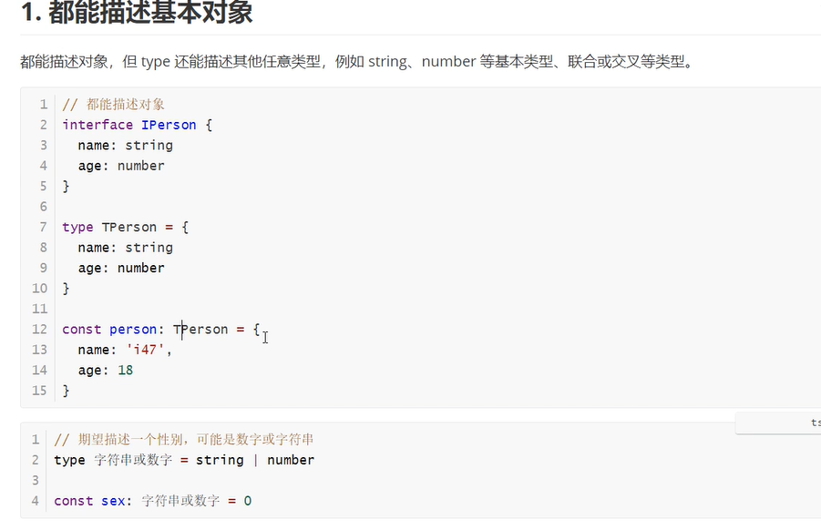

TS 里 type 和 interface 的区别

const 和 readonly 的区别

any、unknown、never 的区别

内置类型，如 Omit、Pick、Parameter 等等

tsconfig 中一般进行的配置

https://zhuanlan.zhihu.com/p/631676206

### 说一下 typescript 中的泛型

[前端*面试题:说一下*typescript 中的 _泛型_ *前端 泛型*千锋 HTML...](https://www.baidu.com/link?url=41LUTjcc7kOXN7S-BxmLwXyWUajSxzTjY3OfFGLmbkhbgl23Fhjt4QdvqxV38gKPbDEYU7u8hD7vacI1TfanYdqdHWkQC87A1lXX3VuaYWi&wd=&eqid=e3e380c6000eb3710000000664925f35)

### ts 中 type 与 interface 的差别

### ts 用到了哪些属性

### ts 什么时候会写的
